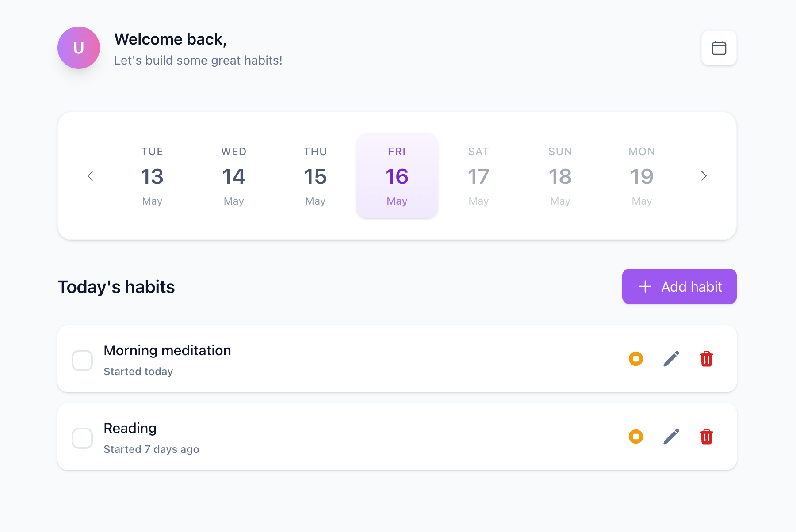
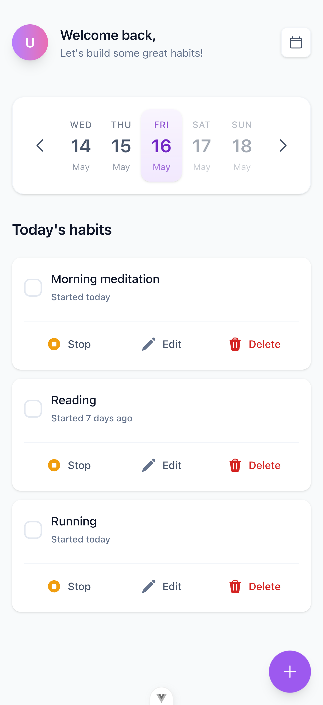

# Habits App

A modern, mobile-first habit tracking application built with Vue 3, TypeScript, and Vite. Track your daily habits, monitor progress, and build consistent routines.

## Features

- 📱 Mobile-first responsive design
- 📅 Weekly habit tracking
- 📆 Calendar date picker for easy navigation
- ✅ Mark habits as complete/incomplete
- ⏹️ Stop/resume habits
- 🗑️ Delete habits with confirmation
- 📊 View past habits and progress
- 🚫 Prevention of future date entries
- 💾 Local storage persistence

## Screenshots

<div align="center">
  
  <p><em>Main view of the habits tracking interface</em></p>
  
  
  <p><em>Mobile-first responsive design</em></p>
</div>

## Prerequisites

Before you begin, ensure you have installed:

- [Node.js](https://nodejs.org/) (v14.0.0 or higher)
- npm (usually comes with Node.js)

## Installation

1. Clone the repository:

```bash
git clone https://github.com/EveSatke/habits-app.git
cd habits-app
```

2. Install dependencies:

```bash
npm install
```

## Development

To start the development server:

```bash
npm run dev
```

## Testing

Run unit tests with Vitest:

```bash
npm run test
```

### End-to-End Testing with Playwright

To run Playwright end-to-end tests, use:

```bash
npm run test:e2e
```

Make sure your development server is running before executing the tests.

#### Configuration

Create a `.env` file in the root directory with the following content:

```env
PLAYWRIGHT_BASE_URL=http://localhost:5173
```

This URL should match your development server address. The default is set to Vite's default port.

## Building for Production

To create a production build:

```bash
npm run build
```

To preview the production build:

```bash
npm run preview
```

## Tech Stack

- [Vue 3](https://vuejs.org/) - Frontend framework
- [TypeScript](https://www.typescriptlang.org/) - Type safety
- [Vite](https://vitejs.dev/) - Build tool
- [Pinia](https://pinia.vuejs.org/) - State management
- [Vue Router](https://router.vuejs.org/) - Routing
- [Tailwind CSS](https://tailwindcss.com/) - Styling
- [Headless UI](https://headlessui.dev/) - UI components
- [Hero Icons](https://heroicons.com/) - Icons
- [date-fns](https://date-fns.org/) - Date utilities
- [Vitest](https://vitest.dev/) - Unit testing
- [Playwright](https://playwright.dev/) - End-to-end testing
